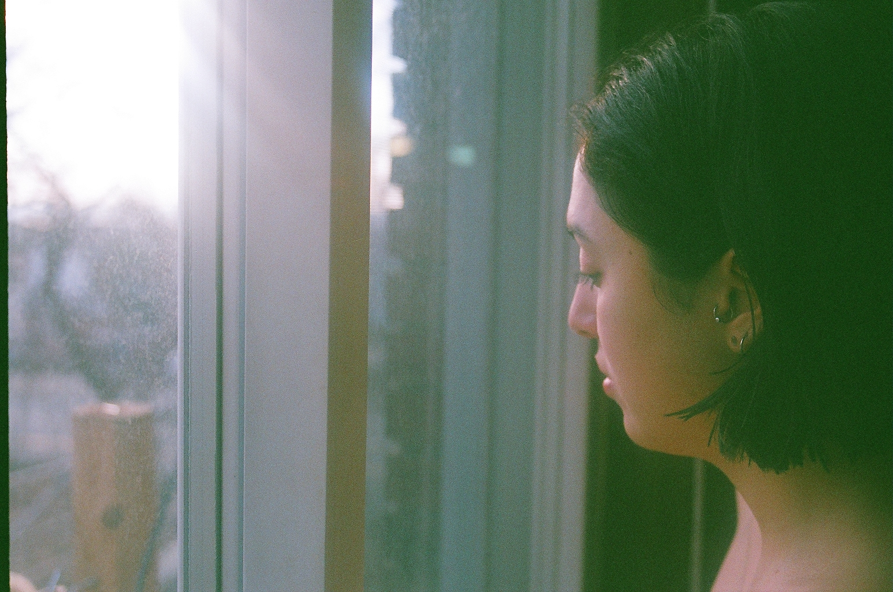

# lauramroa.github.io

## Update instructions

Open up the terminal and go into
the repository directory.

Then run the following command:

    git pull

In the `images` subdirectory, put whatever images you want to display on the site.
It might be best to resize the images so they're not huge.

Then, go into the file `index.html` in a text editor.
Find the following lines:

    <li></li>
    <li></li>
    <li></li>
    <li></li>
    <li></li>

This is a list of images, in order, that is displayed on the website.
Add and remove lines to get the right list in the page.

Then, back in the terminal, run:

    git add .
    git commit -m "New images"
    git push
    
Your website should now be updated.